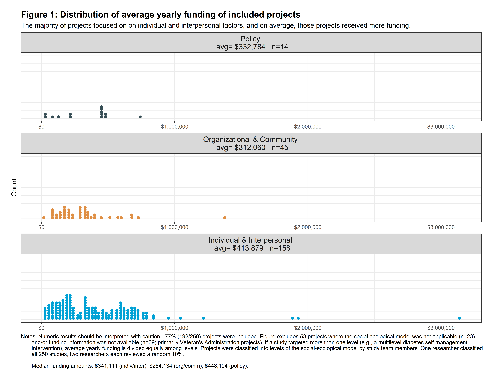
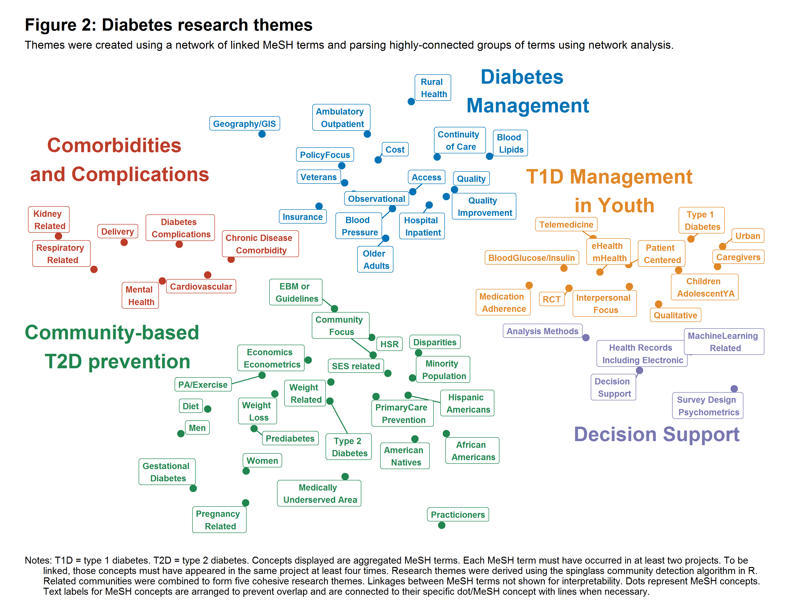

Last Updated `r format(Sys.Date(), format="%m/%d/%Y")`


```{r setup, include=FALSE}
library(knitr)
opts_chunk$set(echo = TRUE)
read_chunk("code/00_setup.R")
read_chunk("code/01_import.R")

read_chunk("code/02a_SEM-tidy-data.R")
read_chunk("code/02b_SEM-figure.R")

read_chunk("code/03a_NETWORK-tidy-data-mesh-meshSimple.R")
read_chunk("code/03b_NETWORK-classify-mesh-words.R")
read_chunk("code/03c_NETWORK-merge-make-network-data.R")
read_chunk("code/03d_NETWORK-word-network.R")

read_chunk("code/functions/classify-funders.R")
read_chunk("code/functions/classify-type.R")
read_chunk("code/functions/mesh-manual-classifications.R")
read_chunk("code/functions/classify-funding-amount.R")
```


Packages needed: 

+ tidyverse
+ magrittr
+ igraph
+ ggnetwork
+ ggsci
+ graphlayouts
+ gdata
+ ggraph

# Initial data cleaning

```{r setup, message=FALSE, warning=FALSE}
```

Import data
```{r dataimport}
```

Classify the primary funder of each study - [see appendix of code for full specification](#funder).
```{r funders}
```

Classify whether a grant was research or not - [see appendix of code for full specification](#research). 
```{r research}
```

Calculate the average yearly funding of grants - [see appendix of code for full specification](#fundingamt). 
```{r avgfunding}
```


Subset to only research, and pull the 250 most recent research projects. 
```{r hsrrecent}
```


Identifying the most common funders of diabetes research, within the 250 most recent projects. 
```{r}
tableone::CreateCatTable(vars=c("primaryFunder"), data=hsrRecent)
```


# Social-ecological classification

## Import and data management
```{r SEMcleaning}
```


## Visualization 
```{r SEMviz, fig.show='hide'}
```

```{r}

```


# MeSH concept network

## MeSH cleaning and classification into concepts
Get a nice dataset of MeSH terms that are simplified. 
```{r meshtidy}
```

Classify MeSH terms into broader concepts. [See the appendix code for granular classifications](#concepts).
```{r meshclassification}
```


## Create network data
Using classified concepts, create vertices and edges for MeSH concept network
```{r meshnetwork}
```

## Detect network subgroups
```{r meshnetwork2, message=FALSE, warning=FALSE}
```

## Visualization
```{r meshnetworkviz, fig.show='hide'}
```

This is the final figure output from R, and community names are added in post-processing in Adobe Illustrator. This illustrator document is contained in the output folder. 
```{r}

```


# Appendix: function code

## Classify funders {#funder}
```{r funderfx}
```

## Classify if project is research {#research}
```{r researchfx}
```

## Clean funding amount {#fundingamt}
```{r fundingamts}
```

## Classify MeSH terms into broad concepts {#concepts}
```{r concepts}
```


